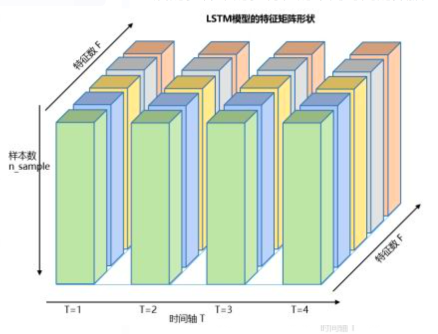
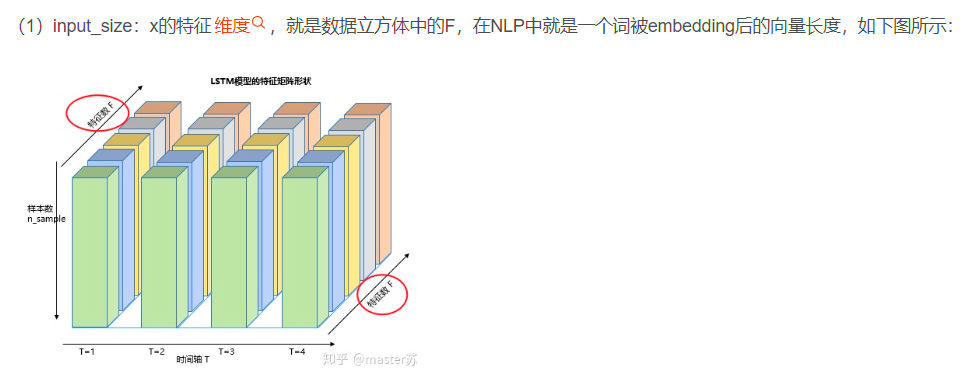
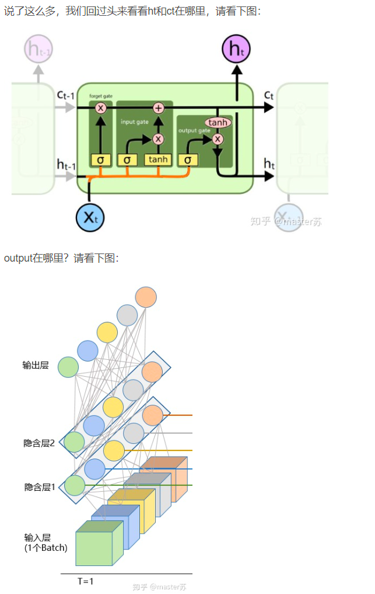

# LSTM的输入数据


第一维度是样本数(n个句子)，第二维度是时间（句子中的n个词），第三维度是特征数（词向量）

``` python
class torch.nn.LSTM(*args, **kwargs)
参数有：
    input_size：x的特征维度
    hidden_size：隐藏层的特征维度
    num_layers：lstm隐层的层数，默认为1
    bias：False则bihbih=0和bhhbhh=0. 默认为True
    batch_first：True则输入输出的数据格式为 (batch, seq, feature)
    dropout：除最后一层，每一层的输出都进行dropout，默认为: 0
    bidirectional：True则为双向lstm默认为False
```



如果设置了batch_first，Bi-LSTM的输入矩阵：


# LSTM的输出
```python
output,(ht, ct) = net(input)
    output: 最后一个状态的隐藏层的神经元输出
    ht：最后一个状态的隐含层的状态值
    ct：最后一个状态的隐含层的遗忘门值
```

output的默认维度
```python
output(seq_len, batch, hidden_size * num_directions)
ht(num_layers * num_directions, batch, hidden_size)
ct(num_layers * num_directions, batch, hidden_size)
```




